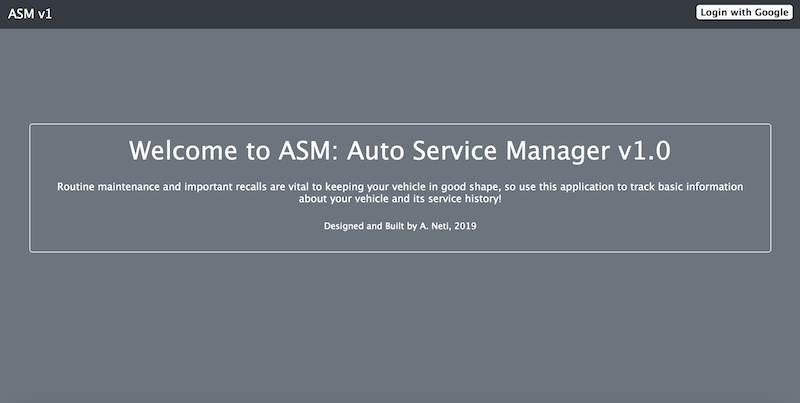
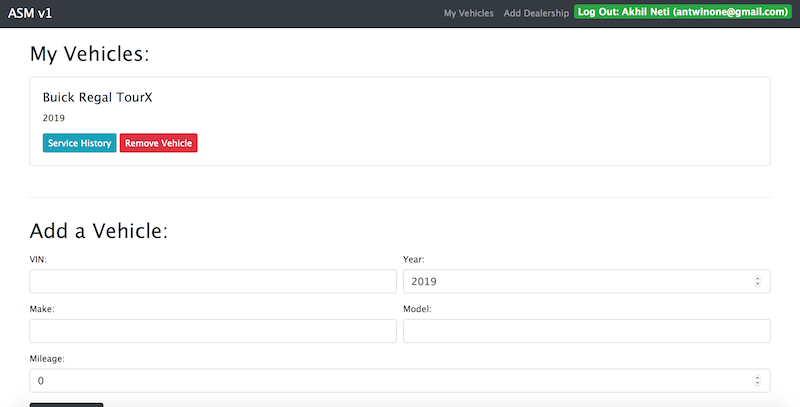
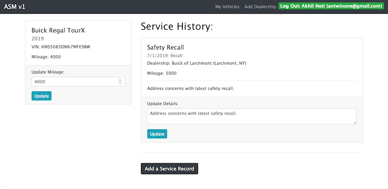

# AUTO SERVICE MANAGER
Project 2 (Full-Stack CRUD Application)

## Description

This application is a full-stack web app that tracks the service history of each vehicle that an individual owns. A user can add, update, and delete vehicles, as well as, add and update any associated service history. A user can also include the dealership information associated with a particular service.

## Getting Started

You can access the application by clicking here: [Auto Service Manager v1.0](https://auto-service-manager.herokuapp.com)

The application uses Google OAuth2, so please use a Google Account to login.

## Technologies Used

- HTML5
- CSS3 (Bootstrap v4.3)
- JavaScript
- Node.js
- Express.js
- Mongoose ODM
- MongoDB

## Screenshots

Main Landing Page:

My Vehicles Page:

Services Page:

## Next Steps

- Implement ability to add a dealership info to a vehicle
- Implement a way to hide the panel to edit/update certain vehicle or service properties
- Make the application responsive to different screen sizes
- Add a user profile page with additional parameters

